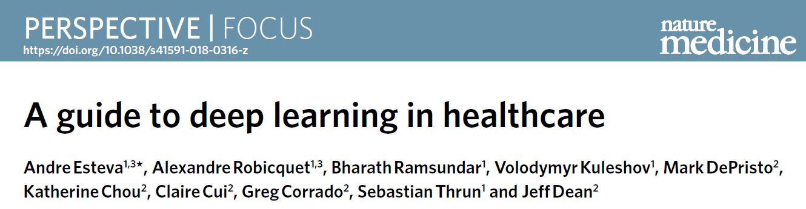

这篇文章从应用于医疗行业的计算机视觉、自然语言处理、强化学习和通用方法入手，详细介绍了深度学习在医疗中的应用。

---

> 题目：A guide to deep learning in healthcare
>
> 期刊：Nature Medicine
>
> 作者：Jeff Dean等
>
> 来源：[机器之心翻译](https://mp.weixin.qq.com/s?__biz=MzA3MzI4MjgzMw==&mid=2650755510&idx=1&sn=8f2238e3e7e0259314271150a81234fd&chksm=871a95c8b06d1cde89131f831ac40442b121c6f56215964a48cdb6f8367bce08ce2acd53697b&mpshare=1&scene=1&srcid=0114QP7t0qIqb9lVOp1Xy4Vq#rd)推荐

## 文章架构

## 作图

## 词语

1. `resurgence`复活，再现

> Deep learning, a subfield of machine learning (ML), has seen a dramatic  **resurgence** in the past 6 years, largely driven by increases in computational power and the availability of massive new datasets.

2. `physician`医师  `demonstration`示范 `wounds`伤口

> RL can be useful in healthcare whenever(每当) learning requires physician demonstration, for instance in learning to suture wounds for robotic-assisted surgery.

1. `resurgence`复活，再现

> Deep learning, a subfield of machine learning (ML), has seen a dramatic  **resurgence** in the past 6 years, largely driven by increases in computational power and the availability of massive new datasets.

